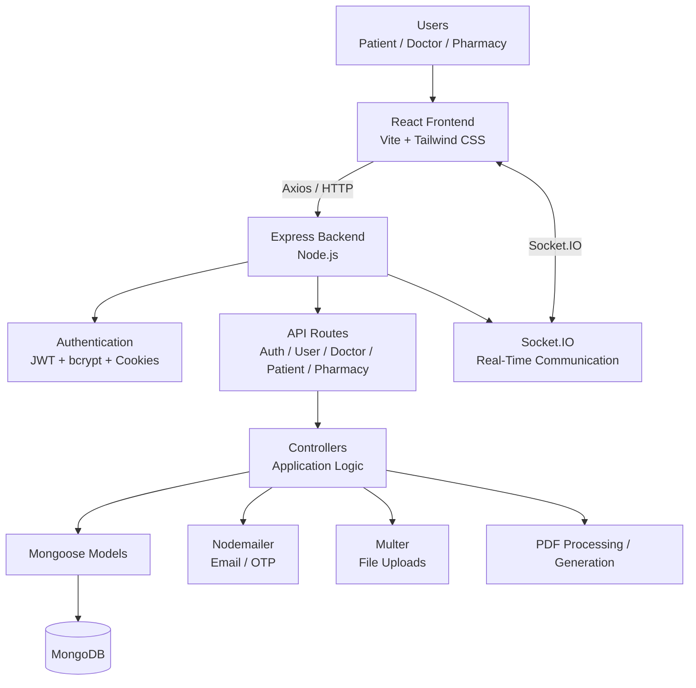
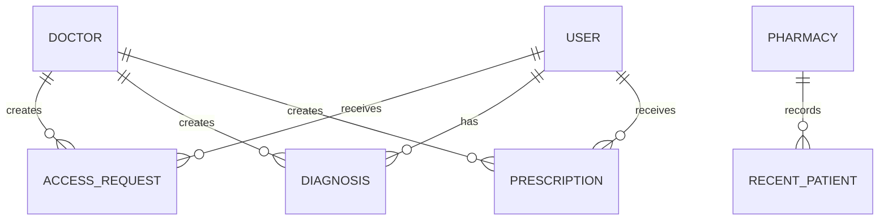

# MediLink 🩺

**One ID. Your Complete Medical Record.**

MediLink is a full-stack digital health record platform designed to connect **Patients, Doctors, and Pharmacies** around a unique Patient ID.

The platform is built around a consent-based workflow: patients can receive and manage access requests from doctors, doctors can work with patient records and prescriptions, and pharmacies can access prescription-related information through dedicated workflows.

---

## 📖 Table of Contents

- [Problem Statement](#-problem-statement)
- [Solution Overview](#-solution-overview)
- [Core Principle](#-core-principle)
- [Key Features](#-key-features)
- [Features by Role](#-features-by-role)
- [Technology Stack](#-technology-stack)
- [System Architecture](#-system-architecture)
- [Application Flow](#-application-flow)
- [Consent and Access Flow](#-consent-and-access-flow)
- [Authentication Flow](#-authentication-flow)
- [Prescription Flow](#-prescription-flow)
- [Project Structure](#-project-structure)
- [Backend Architecture](#-backend-architecture)
- [Frontend Architecture](#-frontend-architecture)
- [Database Models](#-database-models)
- [Security](#-security)
- [Real-Time Communication](#-real-time-communication)
- [PDF and QR Features](#-pdf-and-qr-features)
- [Email Services](#-email-services)
- [AI Integration Status](#-ai-integration-status)
- [Getting Started](#-getting-started)
- [Environment Variables](#-environment-variables)
- [Available Scripts](#-available-scripts)
- [Deployment](#-deployment)
- [Future Scope](#-future-scope)
- [Team / Credits](#-team--credits)
- [License](#-license)

---

## 🏥 Problem Statement

Patient medical history is fragmented across hospitals, clinics, and pharmacies. Patients repeat their history verbally at every visit, carry physical prescriptions, and have no reliable way to track their diagnosis timeline. Pharmacies have no trustworthy way to verify whether a prescription is genuine or current. There is no unified, patient-controlled, consent-based system that lets a patient own their data while granting temporary, revocable access to healthcare providers.

---

## 💡 Solution Overview

The application is divided into three main user experiences:

### Patient

Patients can manage their health information, view diagnoses and prescriptions, and respond to doctor access requests.

### Doctor

Doctors can search for patients using their Patient ID, request access, view authorized patient information, add diagnoses, and create prescriptions.

### Pharmacy

Pharmacies have a dedicated workflow for patient lookup and prescription-related operations.

The backend exposes separate API route groups for authentication, users, doctors, patients, and pharmacies.

---

## 🔑 Core Principle

> **Consent-first. Minimal-access. Patient-controlled medical information.**

The implementation includes an access-request model with states such as `pending`, `granted`, `rejected`, `revoked`, and `expired`, together with `grantedAt` and `expiresAt` timestamps.

---

## ✨ Key Features

- 👤 Role-based workflows for patients, doctors, and pharmacies
- 🆔 Unique Patient ID based record lookup
- 🔐 JWT-based authentication
- 🔑 Password hashing using bcrypt
- 🍪 Authentication through HTTP-only secure cookies
- 📧 Email verification using OTP
- 🔄 Password reset using email OTP
- 🤝 Doctor-to-patient access requests
- ⏳ Time-based access request states
- 🔔 Real-time Socket.IO communication
- 🩺 Diagnosis and medical history management
- 💊 Prescription creation and management
- 📄 Prescription PDF generation/viewing
- 📤 File upload support using Multer
- 📱 QR-code generation support
- 🏪 Dedicated pharmacy workflow
- 📬 Email communication through Nodemailer
- 🧩 Joi-based validation support
- 🌐 CORS configuration for frontend/backend communication

---

## 👥 Features by Role

### 🧑‍⚕️ Patient

The patient-side application includes functionality for:

- Patient registration and authentication
- Email/account verification
- Unique Patient ID
- Patient dashboard
- Diagnosis and medical history viewing
- Prescription viewing
- Doctor access-request management
- Accepting, rejecting, and revoking access requests
- Real-time access-related updates
- QR-code based Patient ID representation
- Password reset and account-related operations

### 🩺 Doctor

The doctor-side workflow includes:

- Doctor registration
- Doctor authentication
- Doctor profile information
- Patient lookup using Patient ID
- Sending patient access requests
- Receiving access status updates
- Viewing authorized patient information
- Adding diagnosis information
- Managing prescription information
- Prescription PDF generation/viewing
- Uploading supporting files where applicable

### 💊 Pharmacy

The pharmacy-side workflow includes:

- Pharmacy registration
- Pharmacy authentication
- Pharmacy profile/account management
- Patient lookup
- Prescription result viewing
- Prescription viewing
- Prescription-related operations
- Recent patient/prescription lookup support

---

## 🛠️ Technology Stack

The repository uses the following technologies in the current implementation.

### Frontend

| Technology | Purpose |
|---|---|
| **React 19** | User interface |
| **Vite** | Frontend development server and build tool |
| **React Router DOM** | Client-side routing |
| **Tailwind CSS 3** | Utility-first styling |
| **Axios** | HTTP/API communication |
| **Socket.IO Client** | Real-time communication |
| **React Toastify** | Toast notifications |
| **Lucide React** | Icons |
| **React Icons** | Additional icon library |
| **React PDF Renderer** | PDF rendering/generation support |
| **jsPDF** | PDF generation |
| **html2canvas** | HTML-to-canvas conversion |
| **html2pdf.js** | HTML-to-PDF conversion |
| **qrcode / qrcode.react** | QR-code generation |

### Backend

| Technology | Purpose |
|---|---|
| **Node.js** | JavaScript runtime |
| **Express 5** | Backend web framework |
| **MongoDB** | Database |
| **Mongoose** | MongoDB ODM |
| **Socket.IO** | Real-time communication |
| **JWT / jsonwebtoken** | Authentication tokens |
| **bcrypt** | Password hashing |
| **Multer** | File uploads |
| **Nodemailer** | Email delivery |
| **Joi** | Data validation |
| **cookie-parser** | Cookie handling |
| **CORS** | Cross-origin request handling |
| **dotenv** | Environment configuration |
| **Nodemon** | Development server restart |

### Architecture Style

The project can be described as a:

> **MERN-style full-stack web application with Socket.IO**

The repository is split into independent `frontend` and `backend` applications rather than being a single combined application.

---

## 🏗️ System Architecture



The backend entry point creates an HTTP server around Express, connects to MongoDB, initializes Socket.IO, configures middleware, and mounts the authentication, user, doctor, patient, and pharmacy routes.

---

## 🔄 Application Flow

The general request flow is:

```text
User
  │
  ▼
React Frontend
  │
  │ Axios / HTTP
  ▼
Express Server
  │
  ▼
Route
  │
  ▼
Controller
  │
  ▼
Mongoose Model
  │
  ▼
MongoDB
  │
  ▼
Response
  │
  ▼
React UI
```

For real-time events:

```text
React Frontend
      │
      │ Socket.IO
      ▼
Socket.IO Server
      │
      ▼
Patient-specific Room
      │
      ▼
Real-time Event
      │
      ▼
React UI
```

---

## 🔄 Consent and Access Flow

The repository contains a dedicated `accessRequestModel` that represents doctor-patient access requests.

The access lifecycle is represented by:

```text
Doctor
  │
  │ Patient ID
  ▼
Create Access Request
  │
  ▼
Pending
  │
  ├───────────────► Rejected
  │
  ▼
Granted
  │
  ├───────────────► Revoked
  │
  └───────────────► Expired
```

The access request model stores:

- Doctor reference
- Doctor custom ID
- Patient reference
- Patient custom ID
- Request status
- Grant timestamp
- Expiration timestamp
- Creation/update timestamps

This provides the backend with a persistent representation of the access state instead of relying only on frontend UI state.

---

## 🔐 Authentication Flow

The current authentication implementation uses:

- `jsonwebtoken`
- `bcrypt`
- `cookie-parser`
- HTTP-only cookies
- Secure cookies
- Email verification OTP
- Password-reset OTP

Simplified flow:

```text
User
 │
 ├── Register
 │
 ▼
User Record Created
 │
 ▼
Email Verification OTP
 │
 ▼
Email Verified
 │
 ▼
Login
 │
 ├── bcrypt password comparison
 │
 └── JWT generation
 │
 ▼
Secure HTTP-only Cookie
 │
 ▼
Authenticated Requests
```

The backend signs JWTs using `JWT_SECRET` and sets a `token` cookie with `httpOnly`, `secure`, and `sameSite: "none"` settings.

---

## 💊 Prescription Flow

Prescription functionality is implemented through dedicated backend models/controllers and frontend interfaces.

A simplified flow is:

```text
Doctor
  │
  ▼
Authorized Patient
  │
  ▼
Prescription Builder
  │
  ├── Medicine
  ├── Dosage
  ├── Frequency
  ├── Timing
  ├── Duration
  └── Quantity
  │
  ▼
Prescription Model
  │
  ▼
MongoDB
  │
  ▼
PDF Generation / Viewing
  │
  ▼
Patient / Pharmacy Workflow
```

The prescription model contains a medicine array with fields including:

- Medicine name
- Dosage
- Frequency
- Timing
- Duration
- Total quantity

It also stores the doctor reference, Patient ID, notes, date, and timestamps.

---

## 📁 Project Structure

The repository is organized into separate frontend and backend applications.

```text
Trix/
│
├── backend/
│   ├── config/
│   │   └── nodemailer.js
│   │
│   ├── controllers/
│   │   ├── accessRequestControler.js
│   │   ├── authController.js
│   │   ├── doctorController.js
│   │   ├── multer.js
│   │   ├── patientController.js
│   │   ├── pdfController.js
│   │   ├── pharmacyController.js
│   │   └── userController.js
│   │
│   ├── middleware/
│   │   ├── doctorMiddleware.js
│   │   ├── pharmacyMiddleware.js
│   │   └── userAuth.js
│   │
│   ├── models/
│   │   ├── accessRequestModel.js
│   │   ├── diagnosisModel.js
│   │   ├── doctorModel.js
│   │   ├── pharmacyModel.js
│   │   ├── prescriptionModel.js
│   │   ├── prescriptionPdfModel.js
│   │   ├── recentPatientModel.js
│   │   └── userModel.js
│   │
│   ├── routes/
│   │   ├── authRoute.js
│   │   ├── doctorRoute.js
│   │   ├── patientRoute.js
│   │   ├── pharmacyRoute.js
│   │   └── userRoute.js
│   │
│   ├── server/
│   │   └── mongodb.js
│   │
│   ├── package.json
│   ├── package-lock.json
│   ├── server.js
│   └── vercel.json
│
├── frontend/
│   ├── public/
│   │
│   ├── src/
│   │   ├── assets/
│   │   ├── cards/
│   │   ├── component/
│   │   ├── context/
│   │   ├── doctor/
│   │   ├── pages/
│   │   ├── paitent/
│   │   ├── pharmacy/
│   │   ├── utils/
│   │   ├── App.jsx
│   │   ├── index.css
│   │   └── main.jsx
│   │
│   ├── .gitignore
│   ├── README.md
│   ├── eslint.config.js
│   ├── index.html
│   ├── package.json
│   ├── package-lock.json
│   ├── postcss.config.js
│   ├── tailwind.config.js
│   ├── vercel.json
│   └── vite.config.js
│
├── .gitignore
├── README.md
└── devDependencis.txt
```

> **Note:** `paitent/` and `accessRequestControler.js` are intentionally written exactly as they currently appear in the repository.

---

## 🧩 Backend Architecture

The backend follows a modular **Routes → Controllers → Models** structure.

### `config/`

Contains configuration modules.

Currently includes:

- `nodemailer.js` — SMTP transporter configuration.

### `controllers/`

Contains request-handling and application logic.

| Controller | Responsibility |
|---|---|
| `authController.js` | Registration, login, logout, email verification, password reset and authentication-related operations |
| `userController.js` | User-related operations |
| `doctorController.js` | Doctor and doctor-side operations |
| `patientController.js` | Patient-side operations |
| `pharmacyController.js` | Pharmacy operations |
| `accessRequestControler.js` | Doctor-patient access request operations |
| `pdfController.js` | Prescription/PDF-related operations |
| `multer.js` | Upload-related configuration |

### `middleware/`

Contains role/authentication middleware:

- `userAuth.js`
- `doctorMiddleware.js`
- `pharmacyMiddleware.js`

### `models/`

Contains Mongoose schemas/models for the application's main data entities.

### `routes/`

Contains API route definitions:

```text
/api/auth
/api/user
/api/doctor
/api/patient
/api/pharmacy
```

### `server/`

Contains database connection logic.

`mongodb.js` connects Mongoose to MongoDB using:

```text
MONGODB_URI
```

### `server.js`

The main backend entry point:

1. Loads Express and middleware
2. Loads environment variables
3. Creates the HTTP server
4. Connects to MongoDB
5. Initializes Socket.IO
6. Configures CORS
7. Configures JSON and cookie parsing
8. Registers API routes
9. Starts the server

---

## 🎨 Frontend Architecture

The frontend is a React single-page application powered by Vite.

```text
frontend/
└── src/
    ├── assets/
    ├── cards/
    ├── component/
    ├── context/
    ├── doctor/
    ├── pages/
    ├── paitent/
    ├── pharmacy/
    ├── utils/
    ├── App.jsx
    ├── index.css
    └── main.jsx
```

### Important frontend areas

| Directory | Purpose |
|---|---|
| `assets/` | Static frontend assets |
| `cards/` | Card-oriented UI components |
| `component/` | Reusable UI components |
| `context/` | React context/state-related logic |
| `doctor/` | Doctor-specific UI/features |
| `pages/` | Application pages |
| `paitent/` | Patient-specific UI/features |
| `pharmacy/` | Pharmacy-specific UI/features |
| `utils/` | Utility/helper functions |

### Main entry points

- `main.jsx` — React application entry point
- `App.jsx` — Main application component
- `index.css` — Global stylesheet

---

## 🗄️ Database Models

MediLink uses **MongoDB** with **Mongoose**.

The repository currently contains the following Mongoose models:

| Model | File | Purpose |
|---|---|---|
| Access Request | `accessRequestModel.js` | Doctor-patient access lifecycle |
| Diagnosis | `diagnosisModel.js` | Patient diagnosis information |
| Doctor | `doctorModel.js` | Doctor information |
| Pharmacy | `pharmacyModel.js` | Pharmacy information |
| Prescription | `prescriptionModel.js` | Prescription and medicine information |
| Prescription PDF | `prescriptionPdfModel.js` | PDF-related prescription records |
| Recent Patient | `recentPatientModel.js` | Recent patient lookup information |
| User | `userModel.js` | Core user/account information |

### High-level relationship



> This diagram represents the application's model relationships at a high level. The actual Mongoose schemas should be treated as the source of truth for field-level relationships.

---

## 🔐 Security

The repository implements several application-level security mechanisms.

### Password Hashing

Passwords are processed with **bcrypt** rather than stored as plaintext.

### JWT Authentication

The backend uses `jsonwebtoken` to generate authentication tokens.

### HTTP-only Cookies

The authentication token is placed in an HTTP-only cookie, reducing direct JavaScript access to the cookie.

### Secure Cookie Configuration

The current login implementation configures:

```text
httpOnly: true
secure: true
sameSite: "none"
```

### Email Verification

Account verification is implemented using OTPs sent through email.

### Password Reset

Password-reset OTPs are generated, hashed with bcrypt, stored with an expiration time, and verified before allowing a password change.

### Role-specific Middleware

The backend includes separate middleware modules for:

- User authentication
- Doctor access
- Pharmacy access

### Input Validation

Joi is included in the backend stack for validation.

### CORS

The backend configures CORS with credentials support and frontend-origin configuration through environment variables.

> **Security note:** This README documents security mechanisms that are present in the repository. It does not claim that the application is production-ready or compliant with healthcare regulations such as HIPAA.

---

## ⚡ Real-Time Communication

MediLink uses **Socket.IO** for real-time communication.

The backend creates a Socket.IO server alongside the Express HTTP server.

A patient can join a Socket.IO room using their custom Patient ID:

```text
join-patient-room
        │
        ▼
Patient Custom ID
        │
        ▼
Socket.IO Room
        │
        ▼
Real-time Events
```

This architecture allows access-related updates to be delivered to the relevant patient interface without requiring the frontend to continuously poll the backend.

---

## 📄 PDF and QR Features

### PDF

The application contains PDF-related functionality on both sides of the application.

Frontend dependencies include:

- `@react-pdf/renderer`
- `jspdf`
- `html2canvas`
- `html2pdf.js`

The backend also contains a dedicated:

```text
pdfController.js
```

and a:

```text
prescriptionPdfModel.js
```

for prescription PDF-related functionality.

### QR Code

The frontend includes:

- `qrcode`
- `qrcode.react`

These packages support QR-code generation for application workflows such as Patient ID sharing.

---

## 📧 Email Services

The backend uses **Nodemailer** with an SMTP relay configuration.

The transporter is configured through:

```text
SMTP_USER
SMTP_PASSWORD
```

The authentication controller also uses:

```text
SENDER_EMAIL
```

for outgoing verification and account-related emails.

Email functionality currently supports:

- Account verification OTP
- Password reset OTP
- Welcome/account emails

---

## 🤖 AI Integration Status

The project was originally positioned for the **AI in Healthcare** hackathon track.

However, the current repository's frontend and backend dependency manifests do **not** show an OpenAI, Claude, Gemini, or other dedicated generative-AI SDK/API integration.

Therefore, the current implementation should **not** claim that AI diagnosis, AI prescription safety checking, or an AI chatbot is already implemented.

### Planned AI possibilities

Future AI functionality could include:

- AI-assisted medical-history summarization
- Symptom analysis assistance for doctors
- Prescription safety checks
- Drug interaction assistance
- Patient-facing health information assistance

Any AI-generated medical information should remain an assistive feature and should not replace qualified clinical judgment.

---

## 🚀 Getting Started

### Prerequisites

Make sure you have installed:

- Node.js
- npm
- MongoDB or a MongoDB Atlas database
- Git

---

### 1. Clone the repository

```bash
git clone https://github.com/TheFrustrator/Trix.git
cd Trix
```

---

### 2. Install backend dependencies

```bash
cd backend
npm install
```

---

### 3. Configure backend environment variables

Create a `.env` file inside the `backend` directory.

Example:

```env
MONGODB_URI=your_mongodb_connection_string
JWT_SECRET=your_jwt_secret
PORT=3000

FRONTEND_URL=http://localhost:5173

SMTP_USER=your_smtp_username
SMTP_PASSWORD=your_smtp_password
SENDER_EMAIL=your_sender_email
```

Use your actual SMTP provider values and MongoDB connection string.

**Never commit real credentials or secrets to GitHub.**

---

### 4. Start the backend

Inside `backend/`:

```bash
npm start
```

The backend defaults to:

```text
http://localhost:3000
```

---

### 5. Install frontend dependencies

Open another terminal:

```bash
cd Trix/frontend
npm install
```

---

### 6. Start the frontend

```bash
npm run dev
```

Vite normally starts the frontend development server at:

```text
http://localhost:5173
```

---

### 7. Open the application

Open the Vite URL shown in the terminal, normally:

```text
http://localhost:5173
```

---

## 🔑 Environment Variables

### Backend

| Variable | Purpose |
|---|---|
| `MONGODB_URI` | MongoDB connection string |
| `JWT_SECRET` | Secret used to sign JWT authentication tokens |
| `PORT` | Backend server port; defaults to `3000` |
| `FRONTEND_URL` | Frontend origin used by backend CORS configuration |
| `FRONTEND_PORT` | Alternative frontend-origin configuration used by the backend |
| `SMTP_USER` | SMTP username |
| `SMTP_PASSWORD` | SMTP password |
| `SENDER_EMAIL` | Sender email address |

> The exact environment variables used by the application should be checked against the current backend source before deployment.

### Frontend

The repository does not provide a dedicated `.env.example` documenting a complete frontend environment-variable contract. Configure frontend API endpoints according to the existing frontend source/configuration when deploying.

---

## 📜 Available Scripts

### Frontend

From `frontend/`:

```bash
npm run dev
```

Starts the Vite development server.

```bash
npm run build
```

Creates the production frontend build.

```bash
npm run lint
```

Runs ESLint.

```bash
npm run preview
```

Previews the production build locally.

### Backend

From `backend/`:

```bash
npm start
```

Starts the backend using Nodemon and `server.js`.

> The backend `package.json` currently does not define a dedicated production build script or test suite.

---

## ☁️ Deployment

The repository contains `vercel.json` configuration files for both:

```text
backend/vercel.json
frontend/vercel.json
```

The backend server code also contains logic to export the Express application for a Vercel serverless environment while avoiding a normal `server.listen()` call in the Vercel production case.

The frontend is a Vite application and can be deployed to platforms that support static Vite builds.

### Recommended deployment architecture

```text
                    Internet
                       │
                       ▼
              ┌─────────────────┐
              │ Vercel Frontend │
              │ React + Vite    │
              └────────┬────────┘
                       │
                    HTTPS
                       │
                       ▼
              ┌─────────────────┐
              │ Backend Hosting │
              │ Node + Express  │
              └───────┬─────────┘
                      │
          ┌───────────┼───────────┐
          ▼           ▼           ▼
      MongoDB      SMTP       Socket.IO
```

> Deployment availability and production configuration should be verified independently. The presence of deployment configuration files does not by itself guarantee that every deployment environment is currently active.

---

## 🔭 Future Scope

Potential improvements include:

- 🤖 AI-assisted medical record summarization
- 💊 AI-assisted prescription safety analysis
- 🧠 Doctor-focused clinical decision support
- 📱 Improved mobile responsiveness / dedicated mobile application
- 🏥 Hospital/clinic integration
- 🔗 Interoperability with external health-record systems
- 📊 Advanced health analytics
- 🌐 Multi-language support
- 🔐 Stronger production security hardening
- 🧾 More advanced prescription verification
- 📈 Comprehensive audit and activity reporting
- ☁️ Production-grade file/object storage
- 🧪 Automated unit, integration, and end-to-end testing

---

## 👨‍💻 Team / Credits

| Name | Contribution |
|---|---|
| **Sudip Bhunia** | Development / Project Implementation |
| **Souvik Das** | Testing, Deployment and Security Standards |
---

## 📄 License

The repository currently uses an **ISC** license declaration in the backend package configuration. The project-level licensing policy should be finalized by the team before production/open-source distribution.

---

## 🔗 Repository

**GitHub:**  
https://github.com/TheFrustrator/Trix

**Live application listed by the repository:**  
[https://trix-orpin.vercel.app/](https://trix-pied.vercel.app/)

---

